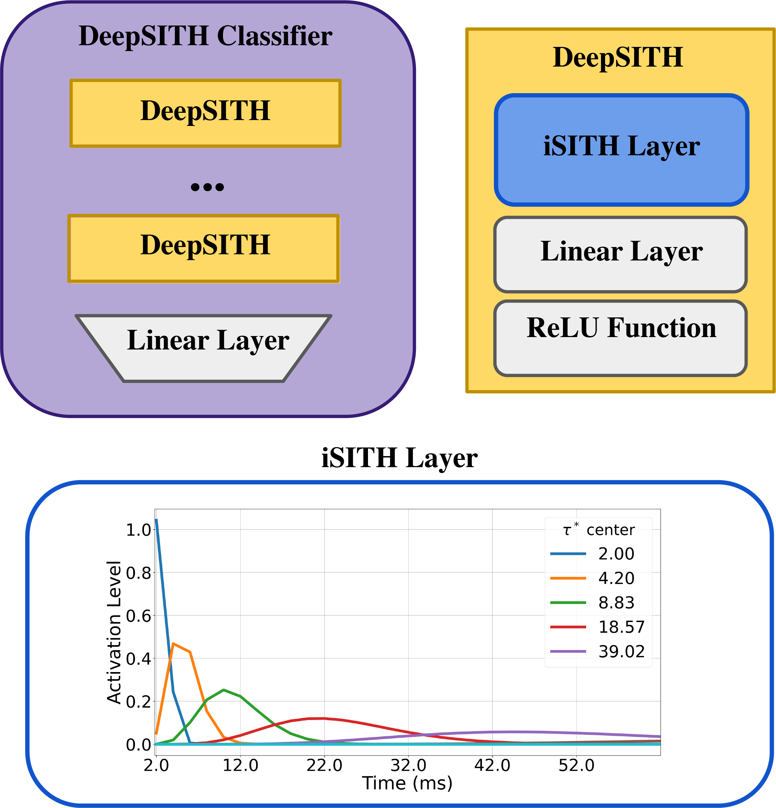
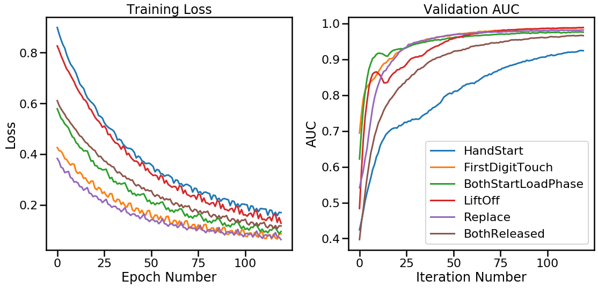

## MSDS Capstone: Scale Invariant Factors for Brain-Computer Interfaces 
### University of Virginia | School of Data Science 

## Documentation

This repository tracks the use and validation of a specialized neural network (Scale Invariant Temporal History (SITH)) that mimics the scale-invariant patterns of the brain's time cells. SITH's development was pioneered by the Computational Memory Lab at the University of Virginia; more information and code can be found here: https://github.com/compmem/SITH_Layer. Our goal is to quanitfy how well SITH can identify actions given EEG data in hopes to improve prediction accuracy of current BCI (Brain-Computer Interface) technology on EEG data by implementing neural features such as time cells as artifical agents. 

All work in this repository belongs to Gaurav Anand (ga7er@virginia.edu), Arshiya Ansari (aa9yk@virginia.edu),Beverly Dobrenz (bgd5de@gmail.com), and Yibo Wang (yw9et@virginia.edu). 

{:height="50%" width="50%"}

## Usage Demo

1. Download the [Grasp-and-Lift EEG Detection data](https://www.kaggle.com/c/grasp-and-lift-eeg-detection/data)

2. Download and install the SITH_Layer-master package from https://github.com/compmem/SITH_Layer

3. Check out example_training.ipynb for installation and training.

4. Submit SLURM job to train on Rivanna (An example is provided  in the Slurm_script folder).

## Preliminary Result (12/15/2020)

**Methods**  
For now, only consider one subject (subject1) for modeling. Predict only one event/channel a time (since there are events overlapping), and incorporate sliding-window standardization and filtering.
Load all eight events and split into 80% training and 20% validation/holdout set.
Use dataset and dataloader pytorch classes to control batch processing.
Use sequence length of 50000 and stride size of 5000 (overlaped sequence for each batch)for each minibatch.

**Note**  
The code is tested on Rivanna with GPU. (may needs some tweaks with CPU only)
Need train_util.py and Deep_isith_EEG.py helper functions as well as the SITH_Layer_master package

**Result**  
Average AUC on the holdout set for all six events for Subject1 is **0.97**  
Average AUC on the holdout set for all events and for all subject is **0.935**

--------------------------------------------------------------------------------

## Final Result

**paper**  
